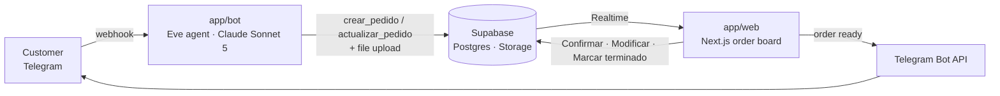

# Print.ai

**Turns messy customer chats into print-ready work orders. The AI proposes; a person confirms.**

Built in one day for **Agents, Everywhere: Bots, Channels & More**, the AI Tinkerers global
hackathon, from the Asunción venue.

Demo video: _add link_

## The problem

Busy print shops like **Printos Super Impresiones**, a real 24-hour print shop in Asunción, Paraguay,
take orders over chat, email and the counter. Every order is a messy conversation: the quantity in
one message, the file in another, "for tomorrow" in a third. At peak hours someone retypes each chat
into a work order, chases the missing details, and checks by hand that the bank transfer arrived
before printing. Orders get delayed, mixed up or lost.

## What we built

An agent that lives where the print shop's work already happens:

- **In the customer's Telegram chat.** The customer writes the way they would talk to the counter
  and sends the PDF or photo right there. The agent builds an order card, marks every missing field
  with ⚠️, asks only for what is missing, and never invents a value.
- **On the shop's live order board.** Cards appear and move between columns without refreshing:
  draft, pending payment, production queue, finished. The admin opens the customer's file, corrects
  a card in plain Spanish ("que sean 60, en A3"), confirms the transfer and marks the job finished.
- **Back in the customer's chat.** When the job is finished, the customer gets a Telegram message
  with the order number to pick it up.

## Why the environment matters

A standalone chatbot can only talk. Print.ai sits between two places that already exist, so the
conversation itself becomes the work order:

- The customer never installs or opens anything new. They order in the chat they already use, and
  the file travels with the order.
- Nobody retypes anything. The chat turns into a row in the shop's production queue, live.
- The environment shapes the workflow. The chat is where data is collected; the panel is where a
  person decides. Nothing reaches production until a human confirms the payment, and the customer
  hears back in the same chat when it is ready.

## Demo flow

1. On Telegram: _"quiero 50 copias de este PDF para mañana"_, with the PDF attached.
2. The agent answers with the card: `🧾 Pedido #1 · Borrador … ⚠️ Falta: tamaño · color · entrega`.
   The card appears on the board at the same moment.
3. The customer: _"A4, a color, paso a retirar"_. The card is complete and moves to pending payment,
   and the agent explains that the shop works with prior bank transfer. It never quotes a price.
4. The admin opens the PDF from the card and clicks **Confirmar pago**: the order enters the
   production queue.
5. The admin clicks **Marcar terminado**: the customer's phone gets _"Su pedido #1 ya está listo…"_.

## How it works



- **One contract.** The bot and the panel never call each other. They meet only in the `pedidos`
  table; its schema lives in [`app/supabase/migrations`](app/supabase/migrations).
- **Rules in code, not only in the prompt.** Typed tools enforce the closed catalog (sizes, color,
  file type, paper/size compatibility), the required fields and the state machine
  `borrador → pendiente_pago → en_cola → terminado`. Every transition is guarded in the query, so a
  confirmed order cannot be edited by the bot.
- **Durable conversations.** Eve keeps one session per chat, so a customer can answer a missing
  field an hour later and the agent still knows the order.
- **Files.** Eve downloads Telegram photos and PDFs into the agent workspace; a tool recognizes the
  type by its bytes and uploads it to a private Supabase Storage bucket. The panel opens it through
  a 60-second signed link.
- **Modificar.** The admin's correction goes through AI SDK structured output with Claude and comes
  back as a validated field diff, not free text.

## Tech stack

| Layer | Technology |
|---|---|
| Agent framework | [Eve](https://eve.dev) 0.54 by Vercel: Telegram channel, typed tools, durable sessions |
| Model | Anthropic **Claude Sonnet 5** through the Vercel AI SDK 7 (`@ai-sdk/anthropic`) |
| Admin panel | Next.js 15.5 (App Router, server actions), React 19, TypeScript strict, Tailwind CSS 4, shadcn/ui on Radix, sonner, next-themes |
| Data | Supabase: Postgres with row-level security, Realtime, Storage |
| Channel | Telegram Bot API |
| Local exposure | Cloudflare Tunnel (`cloudflared`) for the Telegram webhook |
| Built with | Claude Code |

## Run it locally

Requirements: Node.js 24, a Supabase project, an Anthropic API key, a Telegram bot token from
BotFather, and `cloudflared`.

1. **Database.** Run the SQL files in [`app/supabase/migrations`](app/supabase/migrations) in order.
2. **Bot.** In `app/bot`, create `.env.local` with `ANTHROPIC_API_KEY`, `SUPABASE_URL`,
   `SUPABASE_SERVICE_ROLE_KEY`, `TELEGRAM_BOT_TOKEN` and `TELEGRAM_WEBHOOK_SECRET_TOKEN`, then:
   ```bash
   npm install
   npm run dev -- --no-ui --port 2000
   ```
3. **Panel.** In `app/web`, create `.env.local` with `NEXT_PUBLIC_SUPABASE_URL`,
   `NEXT_PUBLIC_SUPABASE_ANON_KEY`, `ANTHROPIC_API_KEY` and `TELEGRAM_BOT_TOKEN`, then:
   ```bash
   npm install
   npm run dev
   ```
   Open http://localhost:3000.
4. **Telegram.** Expose the bot and register the webhook:
   ```bash
   cloudflared tunnel --url http://localhost:2000
   node app/bot/scripts/telegram-webhook.mjs https://<your-tunnel>.trycloudflare.com
   ```
   Run the script from `app/bot` so it finds `.env.local`.

## Scope and known limits

- **No login, on purpose.** It is a one-shop demo; anyone with the panel URL can act on orders.
- **Not built yet:** handing a conversation over to a person, and voice orders at the counter. Both
  are written as briefs in [`02_producto/briefs`](02_producto/briefs).
- **Runs locally** behind a tunnel for the demo; it is not deployed.

## How this repo is organized

This repository holds both the product and how we decided it. Docs are in Spanish, the team's
language; code is in English.

- [`CLAUDE.md`](CLAUDE.md): the project map. Start here.
- [`01_negocio`](01_negocio): the problem, the customer, and a dated decision log.
- [`02_producto/briefs`](02_producto/briefs): one brief per capability; code is only written for
  approved briefs.
- [`recursos`](recursos): the catalog, Printos' policies and voice, the glossary and the stack.
- [`app`](app): the software. `app/bot`, `app/web` and `app/supabase`, mapped in
  [`app/CLAUDE.md`](app/CLAUDE.md).

## Team

**Alen Martínez** and **Mauro Vera**, AI Tinkerers Asunción.
